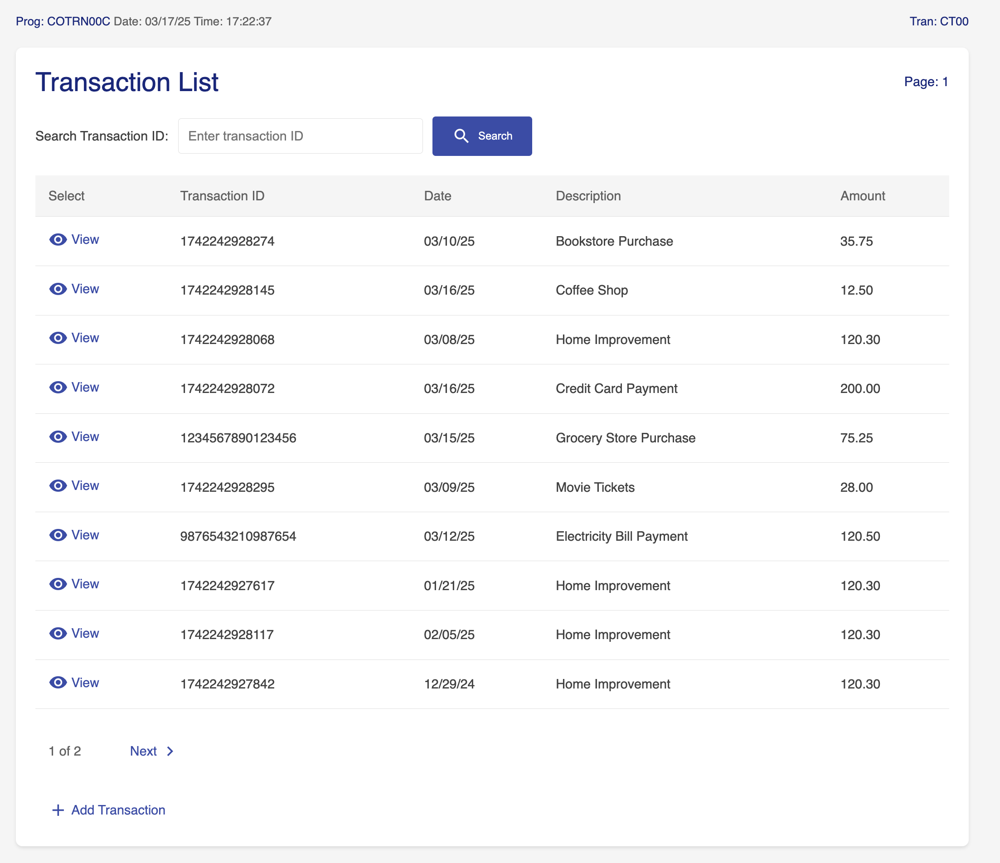
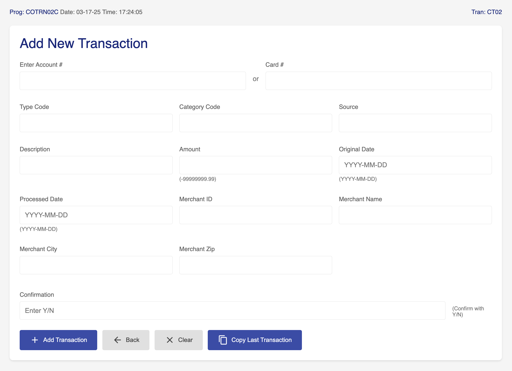
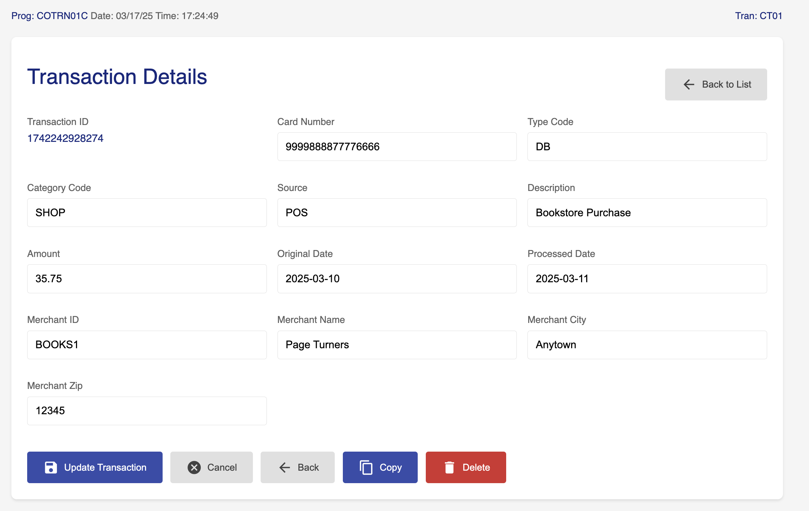
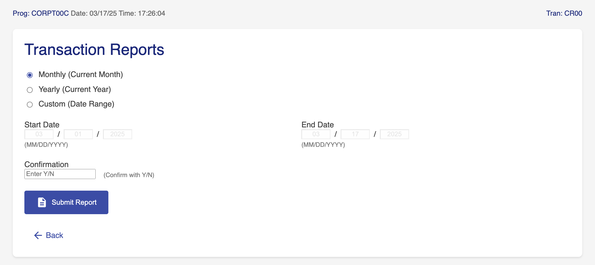

# CardDemo Application

A Spring Boot application for managing card transactions as part of a Legacy Mainframe Application Modernization initiative.

## Prerequisites
- Java 17+
- Apache Maven 3.6+

## Installation
```bash
git clone https://github.com/cacuscacus/mechanized_test.git
cd java_implementation
mvn clean install
```

## Running Locally
```bash
mvn spring-boot:run
```

The application will be available at `http://localhost:8080`

## Key Features
- Transaction management system
- Generates reports
- REST API endpoints for integrations with thirdparty systems

## Project Structure
```
java_implementation/
├── pom.xml                              # Maven build configuration
├── src/
│   └── main/
│       ├── java/com/example/carddemo/
│       │   ├── CardDemoApplication.java  # Main application entry point
│       │   ├── controller/               # REST controllers
│       │   │   ├── HomeController.java
│       │   │   └── TransactionController.java
│       │   ├── model/                    # Domain models
│       │   │   └── Transaction.java
│       │   ├── repository/               # Data access layer
│       │   │   ├── MockTransactionRepository.java
│       │   │   └── TransactionRepository.java
│       │   └── service/                  # Business logic layer
│       │       └── TransactionService.java
│       └── resources/                    # Configuration and static resources
│           ├── application.properties    # Application configuration
│           ├── logs/                     # Log files
│           └── templates/                # Thymeleaf templates
│               └── transactions/
│                   ├── showReport.html
│                   ├── transactionAdd.html
│                   ├── transactionList.html
│                   ├── transactionReport.html
│                   └── transactionView.html
├── target/                              # Build output directory
└── logs/                                # Application logs
```

## Deployment

- You can deploy and run on any JVM compatible device/OS using the /target/carddemo-{version}.jar after the build command finishes. The file contains all the necessary modules/server to run independently (assuming you have a complatible JVM running on your system)

```bash
java -jar carddemo-{version}.jar
```

# Application views

## Transactions list
`http://localhost:8080/transactions`


## Add transaction
`http://localhost:8080/transactions/add`


## View transaction
`http://localhost:8080/transactions/{id}`


## Transactions report
`http://localhost:8080/transactions/report`


## License
TBD