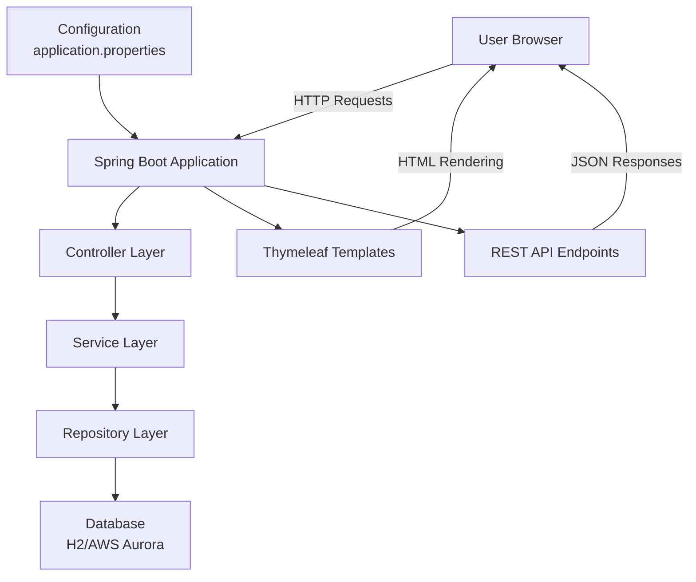
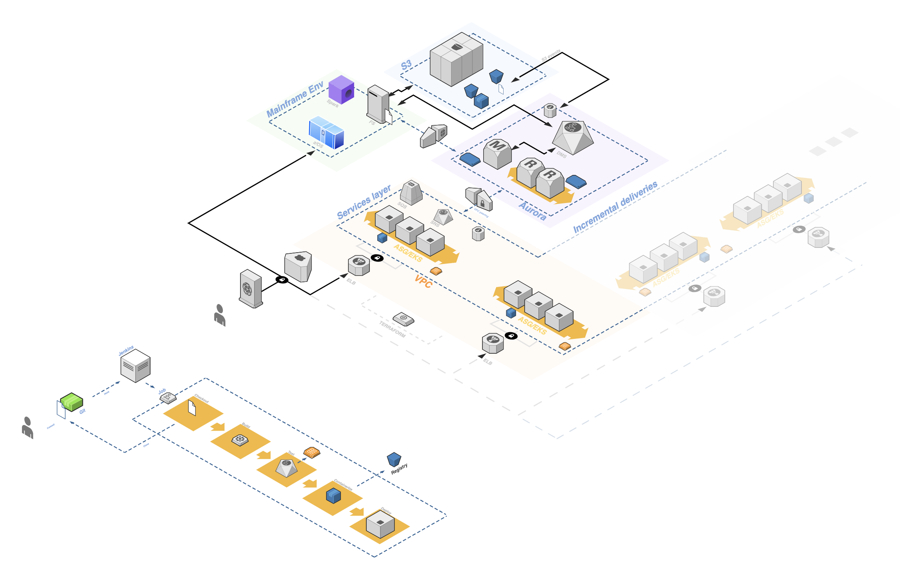
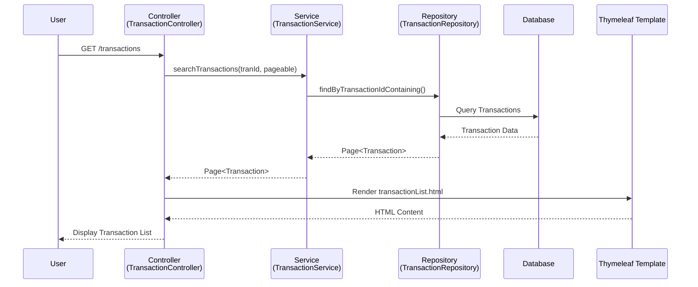
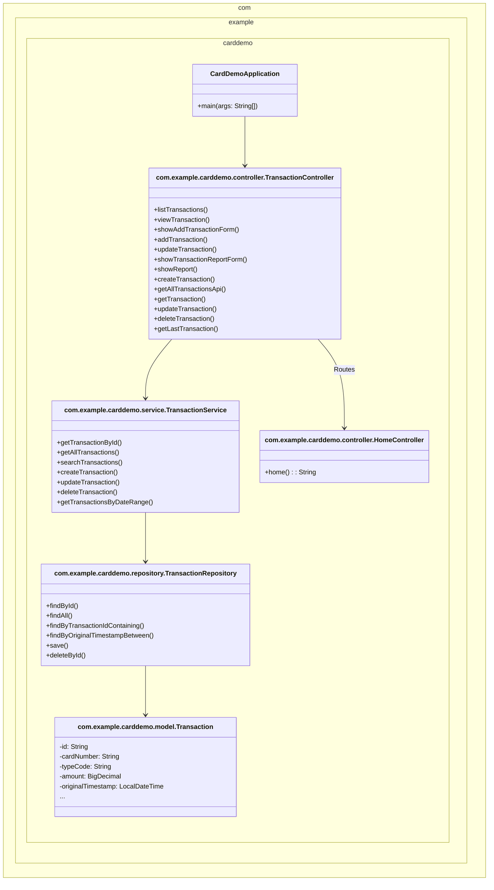
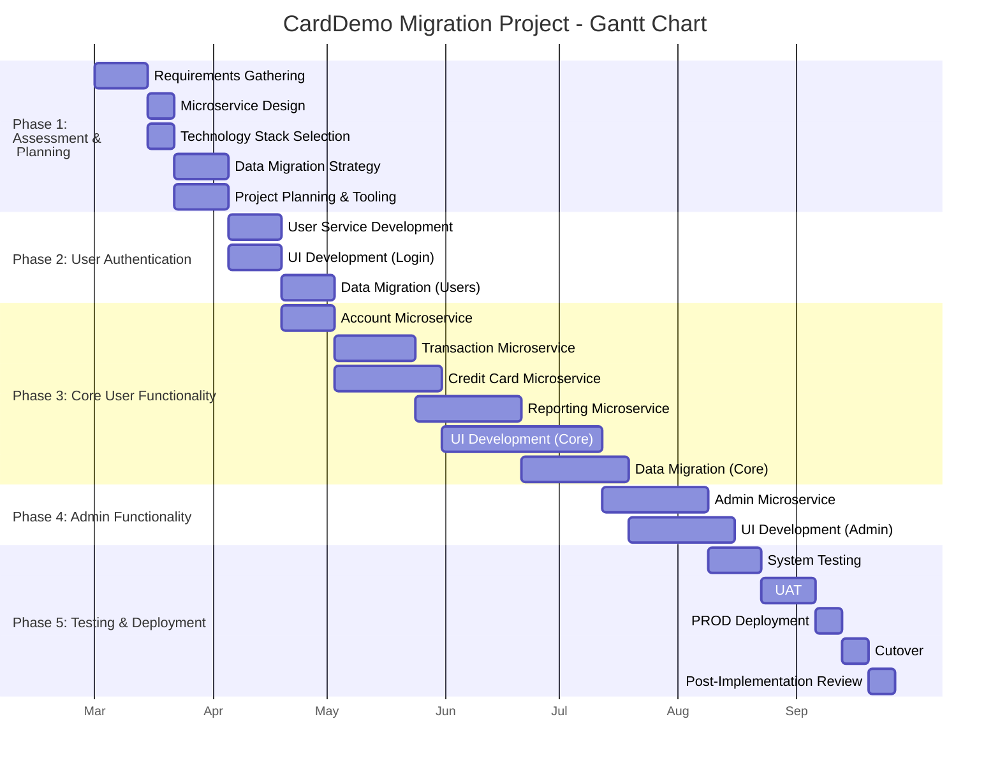

# Mainframe to Java Modernization Exercise

In this document, you’ll find a brief depiction of a migration project. Some considerations have to be taken into account to understand scope limits. The viability of such projects in practice depends not only on planning but also on the execution strategy. This strategy is implemented at the project management and leadership levels. These topics are out of scope for this document but worth mentioning.

"Cloud-agnostic" solutions are mentioned in each topic, as they are an important consideration for C-level and technical staff during decision-making stages regarding budget, economic matters, technical capabilities, and staffing. Trade-offs in terms of cloud-provider dependency, recurring costs, and complexity of implementation and maintenance have to be considered. This is also outside the scope of this document but worth mentioning.

The basic assumption is that the author of this document has no information on the implementation team’s velocity or similar productivity metrics for comparable projects. Therefore, estimating possible delivery dates might result in guesswork.

If C-level management requires a budget for decision-making and customer interactions, ROM estimates and a Gantt chart are provided. However, it is the conviction of the author that these estimates are not scientifically or evidence-based, so the risks of exceeding the margins of error are significant.

Check project_plan.mermaid file for provided gantt diagram or scroll down to the later sections of this document.

## Legacy System Stack Analysis

### Cobol:

**Purpose and Role:**  
COBOL (Common Business-Oriented Language) is the primary programming language in the AWS Card Demo, managing core business logic, data processing, and transactions. It underpins critical operations in sectors like banking and finance.

**Key Characteristics and Constraints:**  
- English-like syntax designed for business applications and readability.  
- Excels in batch processing with strong fixed-format record handling.  
- Procedural paradigm, contrasting with modern object-oriented approaches.  
- Approximately 250 billion lines of COBOL code remain in production globally, per industry estimates, highlighting its enduring enterprise relevance.

**Migration Challenges:**  
- Complex codebases with decades of inconsistent styles from multiple developers.  
- Minimal documentation, with business rules embedded in code, complicating extraction.  
- Shortage of skilled COBOL developers as expertise shifts to modern languages.

**Modern Equivalent:**  
Java is proposed as the replacement due to its object-oriented programming (OOP) capabilities, strong typing, extensive libraries, and robust enterprise ecosystem. It effectively handles complex business logic and transaction processing, aligning with modern development practices.

---

### CICS: Transaction Processing Infrastructure

**Purpose and Role:**  
CICS (Customer Information Control System) manages online transactions, ensuring integrity and connectivity. It coordinates terminal I/O, program execution, and communication in the Card Demo.

**Key Characteristics and Constraints:**  
- Provides commit/rollback, queuing, and program control for transaction management.  
- Supports terminal interactions via Basic Mapping Support (BMS).  
- Ensures ACID compliance but is tightly coupled with COBOL, limiting scalability.  
- Region-based resource partitioning restricts horizontal scaling.

**Migration Challenges:**  
- CICS-specific commands embedded in COBOL code create tight coupling.  
- Stateful architecture contrasts with modern stateless designs.  
- Transaction definitions and configurations require mapping to new constructs.

**Modern Equivalent:**  
Spring Boot is recommended, offering declarative transaction management via `@Transactional`. Spring MVC or WebFlux replaces terminal interactions with HTTP request processing, mirroring CICS capabilities.

---

### VSAM: Data Persistence Layer

**Purpose and Role:**  
VSAM (Virtual Storage Access Method) is the file-based storage system for application data, supporting indexed, sequential, and direct access methods.

**Key Characteristics and Constraints:**  
- Offers Key-Sequenced (KSDS), Entry-Sequenced (ESDS), and Relative Record (RRDS) datasets.  
- Efficient key-based retrieval but lacks SQL support and flexible schemas.  
- Integrates directly with mainframe OS, avoiding separate DBMS requirements.

**Migration Challenges:**  
- Mapping hierarchical file structures to relational schemas.  
- Preserving key relationships and data integrity during transformation.  
- Deciding between online (real-time) or offline (batch) migration strategies.

**Modern Equivalent:**  
PostgreSQL is proposed as a relational database replacement, with Java Persistence API (JPA) and Hibernate providing object-relational mapping. This modernizes VSAM’s persistence layer while enabling advanced querying and analytics.

---

### JCL: Batch Processing Control

**Purpose and Role:**  
JCL (Job Control Language) orchestrates batch processes, defining job execution parameters, resource allocation, and dependencies.

**Key Characteristics and Constraints:**  
- Script-like syntax for job definitions and sequencing.  
- While it integrates with mainframe components, it is incompatible with modern cloud provider solutions.  
- Lacks standardization, with environment-specific parameters embedded in scripts.

**Migration Challenges:**  
- Translating job dependencies and sequences to modern workflows.  
- Extracting and standardizing embedded parameters.  
- Mapping error handling to new systems.

**Modern Equivalent:**  
Spring Batch is suggested for batch processing, with AWS EventBridge + Step Functions, CI/CD pipelines (e.g., Jenkins) or Apache Airflow as alternatives for orchestration and job execution. These tools provide declarative workflows and dependency management, replacing JCL’s functionality.

---

### RACF: Security and Access Control

**Purpose and Role:**  
RACF (Resource Access Control Facility) enforces security, managing authentication, authorization, and auditing in the Card Demo application.

**Key Characteristics and Constraints:**  
- Centralized, role-based access control with detailed audit trails.  
- Integrates with mainframe components but it is also incompatible with new cloud provider's solutions.
- Multi-level security from system to resource access.

**Migration Challenges:**  
- Translating security policies to modern frameworks.  
- Maintaining compliance and audit trails during migration.  
- Preserving role mappings and user experience.

**Modern Equivalent:**  
Spring Security is proposed for application-level security, integrated with AWS Cognito for OAuth2-based authentication. Alternatives like Keycloak or LDAP can be considered based on enterprise needs for self-hosted, self-managed solutions, replacing RACF’s mainframe-specific policies.

---

## Proposed Modern Architecture

Based on the legacy analysis, the following Java-based architecture addresses identified challenges and leverages contemporary technologies.

### Java-Based Technology Stack

**Microservices with Spring Boot:**
- Decouples the monolith into services (e.g., `CardService`, `TransactionService`, `UserService`, etc).  See `TransactionService` example and the overall architecture (including infrastructure) diagrams attached on this report.
- Deployed as Docker containers on AWS ECS or EKS for horizontal scaling with configured ELBs to properly distribute the load and signal the scaling needs. A lightweight version of this would be to setup AMI images to scale using AGS (Auto Scaling Groups) as a starting option, simple configuration.
- Spring Boot provides embedded servers, dependency injection, and transaction management, replicating CICS’s ACID guarantees.  
- AWS SQS queues transactions for low-latency, high-availability processing, with SNS enabling fanout patterns for multiple topics (e.g., Transactions, Cards, etc).

**Data Layer Modernization:**
- VSAM migrates to Amazon Aurora PostgreSQL, with Hibernate ORM for entity mapping. (Check provider's diagrams below for a clearer view)
- Tools like AWS Glue can help with schema discovery and transformation. Alternatively, cloud-agnostic solution can be created using Apache Spark which has z/OS support to work interfacing directly on the mainframe OS.
- AWS DMS (under the hood it is the "Connect" solution from Precisely, requires license) can help with the data migration and replication. Alternative setups can be achieved with Apache Kafka for streaming, Apache Spark for interfacing (cited below) with the mainframe OS/files.

**Assumptions:**
- No ability to introduce new code into the COBOL application, only to interface with the mainframe OS/files.
- No requirement for updating information both ways, only migrating from old to new information flow. For duplex pathways, Apache Spark is necessary to integrate new information into legacy VSAM files (see diagram below).

#### Security Implementation:
- Spring Security with AWS Cognito provides authentication and authorization, replacing RACF.  Open source alternatives like Keycloak will work in a self-configured self-maintained cloud-agnostic solution.
- OAuth2 and JWT ensure modern token-based security.

### Architecture Design

- **Layered Architecture:** At high level architecture, separation of concers into atomic microservices, at service level separates concerns into data (JPA entities, repositories), service (business logic), and controller (REST endpoints and views) layers.  
- **Deployment:** Containerized with Docker, orchestrated via Kubernetes, and provisioned using Terraform. AWS ECS, EKS. AMIs with ELB-ASG configuration is a good starting option, incrementally the solution has to evolve into full terraform IaC for leveraging the creation of new environments and adding new services flexibility, to quote the least of the benefits.
- **Benefits:** Enables horizontal scaling, CI/CD workflow enabler, and independent component scaling, improving over the legacy monolith.

*Basic Java Spring MVC arch*

Refer to: `java_arch.mermaid` file

### Framework Selections

- **Spring Boot:** Core framework with embedded servers and auto-configuration.  
- **Spring Data JPA:** Simplifies data access with Hibernate ORM.  
- **Spring Security:** Secures the application with modern patterns.  
- **PostgreSQL:** Robust relational database replacing VSAM.  
- **Spring Batch:** Handles batch processing, replacing JCL, paired with SQS in a chunk-oriented processing setup. For cloud-agnostic solutions we can replace SQS with Spring Aggregator.
- **Monitoring:** AWS Cloudwatch and alerts, Spring Actuator, Prometheus, and Grafana for observability.

---

### Integration Approach

- **REST APIs:** Replace CICS transactions with Spring Web MVC endpoints, documented via OpenAPI/Swagger.  
- **Event-Driven Processing:** AWS SQS and EventBridge manage asynchronous tasks (e.g., via Step Functions/Lambda functions or calls to the custom endpoints). Alternatively, as mentioned previously, Apache Spark, VSAM - > S3 file sync and S3 Event notifications -> lambda functions, or via SQS queues -> SQS event -> lambda options are available for achieveing same results. After integration, the consolidated data for reporting has to be extracted from PostgreSQL (e.g. Transaction Reports), unless duplex information flow is a requirement of course.

Briefly addressing this potential "duplex" requirement: Spring Batch inserting data from PostgreSQL to the VSAM files using VSE Navigator for mapping and VSE Connector for z/VSE OS. For zOS the prevously mentioned zOS Spark. this requires coordination between the mainframe file system and redefining the SHAREOPTIONS to accept multiple write access.
As these alternatives require implementing non trivial changes in the legacy and since I'm assuming no code changes can be done and there is no CICS program to catch external requests or prefigured to that objective, then this is the least desirable options.

- **Security:** Spring Security can be integrated seamlessly with Cognito AWS services.
- **Strangler Pattern:** Gradually replaces legacy functions, using API gateways for interoperability during migration, provided can put in place a middleware routing between the legacy mainframe and the new services (if applicable).

**Note:** As mentioned before, and considering this is again the case for this topic, AWS-centric solutions (SQS, DMS, Cognito) are emphasized due to the Card Demo’s AWS context. Cloud-agnostic alternatives (e.g., Kafka, Keycloak) are viable but require in-house expertise and maintenance.

---

### Technical Diagrams

1. **High-Level Architecture Diagram:** 
   - Depicts microservices (Customer, Card, Transaction, etc) connected to PostgreSQL and SQS/EventBridge, hosted on AGS/AMI or ECS/EKS. 
2. **CI/CD Pipeline Diagram:**  
   - Shows commit → build → test → deploy stages using Jenkins or GitHub Actions or Jenkins instance.  
3. **Cloud Infrastructure Diagram:**  
   - Illustrates AWS services: AGS and/or ECS/EKS (containers), Aurora/RDS (PostgreSQL), SQS/SNS (messaging), Cloudflare, Route 53, S3, AWS Cognito (security), etc.

*High level implementation diagram*

Refer to `arch_diagram.drawio` file.

---

## Migration Roadmap

### Phase 1: Legacy Code Analysis and Staging

1. **Inventory COBOL Programs:** Analyze `.cbl`, `.bms`, `.jcl`, and `.cpy` files to document logic and dependencies.  
2. **Extract VSAM Metadata:** Map datasets to relational schemas.  
3. **Refactor JCL:** Convert jobs to AWS Step Functions (Lambda) or Spring Batch workflows.

### Phase 2: Incremental Migration

1. **Pilot Service:** Modernize CICS modules as Spring Boot services in incremental deliveries, validated against VSAM stubs.
2. **Data Migration:** Use AWS DMS for zero-downtime ETL, dual-writing to VSAM and PostgreSQL. Cheaper and non-real-time alternative for some tasks can be addressed using VSAM file uploading to S3, triggering the S3 event and then executing lamba functions to integrate the data into PostgreSQL through that, this is probably only valid for daily syncs and not realtime as with the DMS service bundle.
3. **Security Integration:** Map RACF rules to Cognito IAM policies and Spring Security roles.

### Phase 3: Testing and Deployment

1. **Unit Testing:** JUnit/Mockito ensuring logic parity with COBOL
2.  **Contract/Integration testing** Pact4j to verify consistency and interoperability between endpoints of different services on each delivery. This also ensures full coverage while avoiding the integration hell (factorial expression governing the scenarios/combinations in a microservices approach)
3. **Performance Testing:** Gatling tool simulating 10,000 TPS, benchmarking against CICS.  
4. **Blue/Green Deployment:** AWS Route 53 or custom middleware to shifts traffic incrementally to modern APIs/Views.

---

### Data Migration Strategy

- **Analysis:** Profile VSAM structures, map keys, and identify relationships.  
- **Design:** Create a normalized PostgreSQL schema with indexes.  
- **Execution:** AWS DMS extracts, transforms, and loads data, supporting parallel operation.  
- **Verification:** Reconcile record counts and validate business rules.

### Business Logic Translation

- **Approach:** AI assisted manual translation to Java architecture, prioritizing readability, maintainability and extensibility over automated transpiler alternatives. 
- **Process:** Analyze COBOL files and rules, design Java services, implement with Spring Boot, and refactor using MVC patterns (e.g., Controller, Repository, Service, View ).  
- **Tools:** Leverage AI-assisted analysis (e.g., LLMs) for initial boilerplate.

### Integration Points

- **Strategy:** Use AWS DMS for VSAM-to-PostgreSQL replication during coexistence.  
- **APIs:** REST endpoints expose functionality, ensuring frontend-agnostic design.  
- **Testing:** Validate microservices integration with contract tests (e.g., Pact4j).

### Testing Approach

- **Levels:** Unit (JUnit), Integration (Pact), Performance (Gatling), and UAT (Cypress / Manual). Manual testing is of course desirable at later stages and with dedicated QAs or Business staff at staging level.  
- **Automation:** CI/CD pipelines execute tests per commit.  
- **Goals:** Ensure functionality, performance, and data integrity match the legacy system.

---

# Implementation Example: Card Demo Transactions CRUD Operations

*Clarification:* This is a lightweight implementation according to the exercise requirements, excluding testing, persistance layer setup, and infrastructure layer setup.

**Repository:** https://github.com/cacuscacus/carddemo_mai_java.git

*MVC Arch diagram*

*Request Flow diagram*

--- 

*Java components diagram*

---

## Conclusion

This modernization excercise example on transforming the AWS COBOL Card Demo into a scalable, maintainable Java-based system goes through the legacy analysis identifying key challenges —complex code, skill shortages, and tight coupling— and addressing it through a Spring Boot architecture, AWS services, and a phased migration roadmap. The implementation example demonstrates practical translation of CRUD operations, serving as an introduction for further developments. Benefits of this kind of architecture include reduced maintenance costs, improved prospects for developers productivity, and alignment with industry standards, justifying the initial migration investment.

## Tools used and recommendations:

- VSCode IDE with Java, Mermaid, Markdown, Draw.io and RooCode extensions
- Github Copilot, Codeium, Google's AIStudio with Gemini 2.0 Pro for analyzing files with huge context requirements
- Perplexity DeepResearch for researching on COBOL and the legacy stack in general
- PasteMax tool for generating context prompts.
- LLMs involved for code suggestions: DeepSeek R1/v3, Qwen QwQ 32b, Anthropic Claude 3.7, OpenAI o3-mini, Grok, Gemini 2.0 Pro.
- RooCode to implement changes/applying diffs using Gemini 2.0 flash models.
- For grammar and overall writing checks: Qwen QwQ 32b, DeepSeek R1, o3-mini.

---

# ANNEXES
# Project estimated effort (ROM)

Assuming a team of 1 Java Developer and 1 Java/DevOps Engineer (2 FTE), with QA support for testing stages (0.25 FTE), the project requires 7–8 months, totaling approximately 2.25 FTE and 2,520 man-hours.

Estimates on cloud/hardware/licensing associated costs are not plausible to achieve at this stage.
Remember these are just for demonstration purposes, increasng the development team's size (more FTE in total) is always approachable but extra coordination efforts are required and there are friction related to this, the member size translation into performance is not a lineal function and is always a challenge with newly introduced teams. Different considerations apply to already mature and well established teams.

---
Gantt diagram

